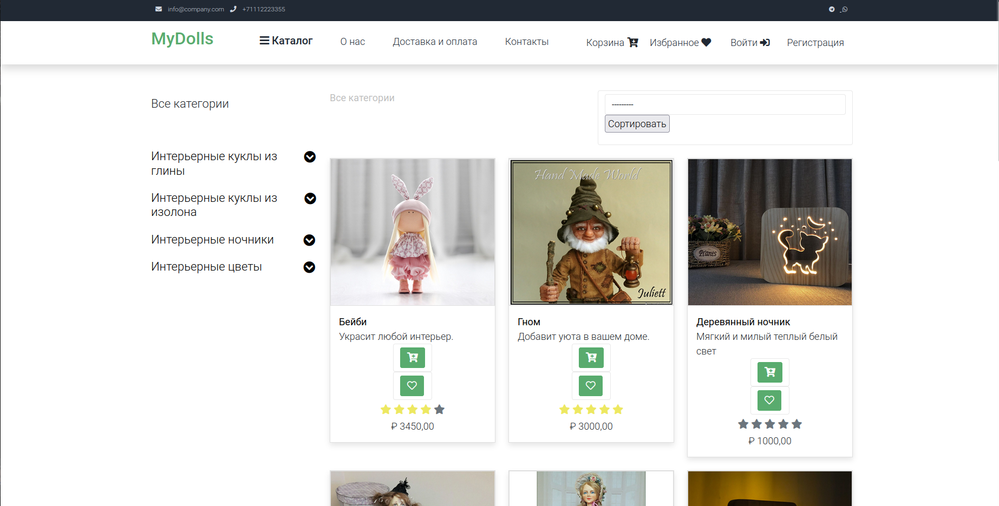
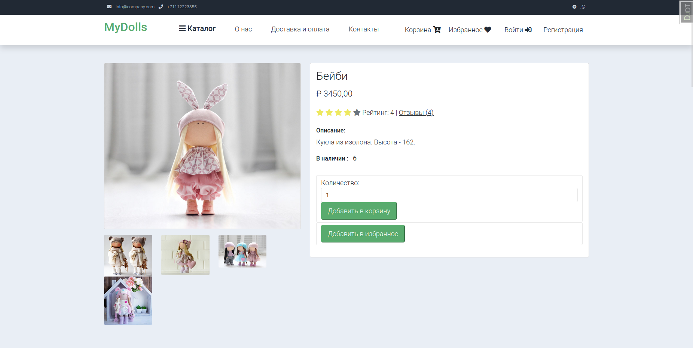
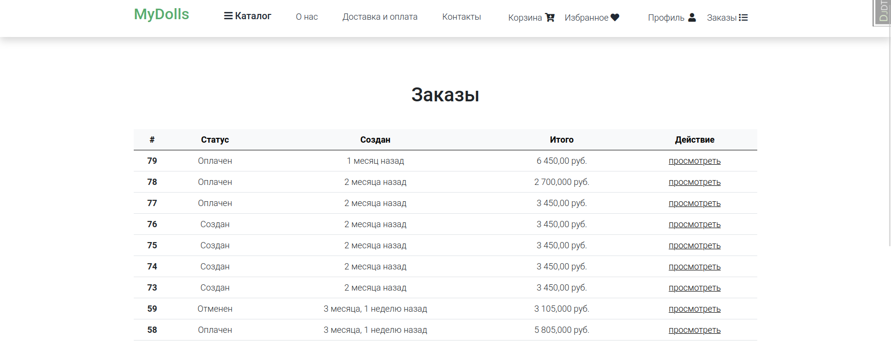
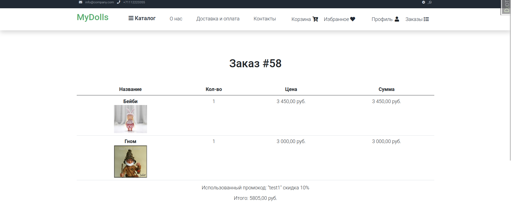

# Web-shop Django

Это реализация интернет-магазина с использованием Django.

### Реализованный функционал:

  *  Регистрация с активацией через почту;
  *  Аутентификация через VK и Яндекс.
  *  Создание товаров с описанием, ценами, фото и т.д. по категориям;
  *  Карточка товара с описанием, фото, и галереей фото товара;
  *  Корзина (через сессию), изменение количества товаров, удаление товаров;
  *  Избранное (через сессию), можно добавить или удалить товар;
  *  Система купонов/промо-кодов, которые добавляют скидку на товар.
  *  Пагинация и сортировка товара.
  *  Заказы и функционал после заказа (письмо на почту клиента и т.д.);
  *  Подключена платежная система ЮKassa (тестовый режим);
  *  Отзывы и оценка товаров;
  *  Личный кабинет с возможностью просмотра заказов, изменение профиля;
  *  Реализована админ панель со всеми необходимыми настройками.
  *  Так же реализовано api с помощью django rest framework.
  *  Тесты для api.

## Общий вид интернет-магазина:
### Каталог

### Детали товара

### Заказы

### Детали заказа

## Что использовано для создания:

    Python 3, HTML, CSS;
    Django Framework;
    PostgreSQL;
    Redis;
    Celery;

## Для запуска приложения используйте docker-compose:
    
    
    1. docker compose build
    2. docker compose up

Переменные заданы в файле `.env.example`.

Приложение запуститься на `http://localhost:8001.`

Для того чтобы работала отправка сообщения на **email** пользователя
после его регистрации для подтверждения **email**,
измените в `.env.example` параметры SMTP на свои, так же и для 
аутентификации через VK и яндекс.

### Для запуска тестов: 
В локальном репозитории используйте команду:

    make run tests

### Тестовый суперпользователь:

Логин: admin 

Пароль: admin
